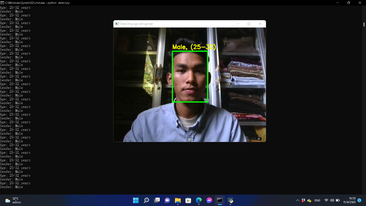
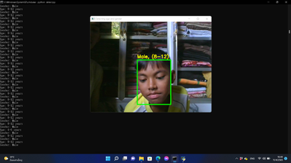
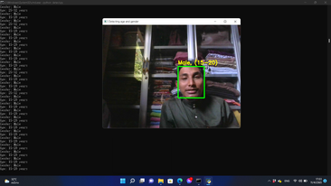
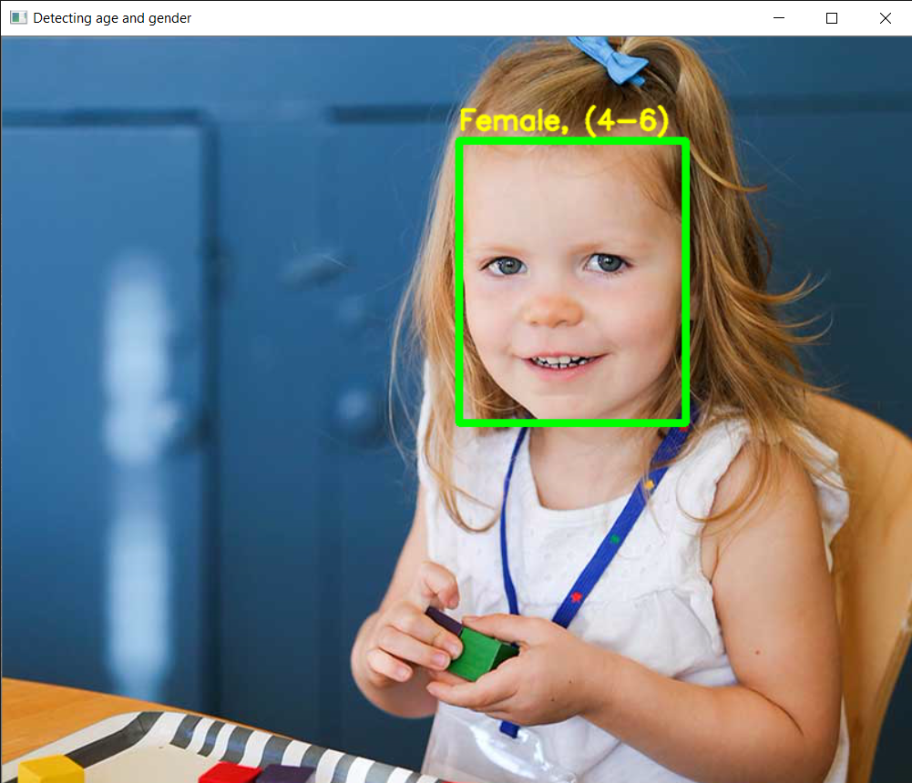
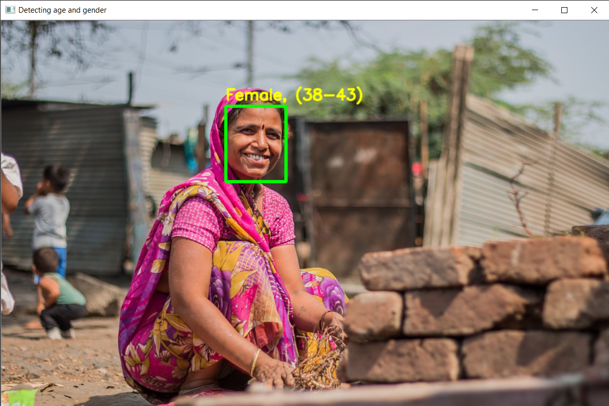
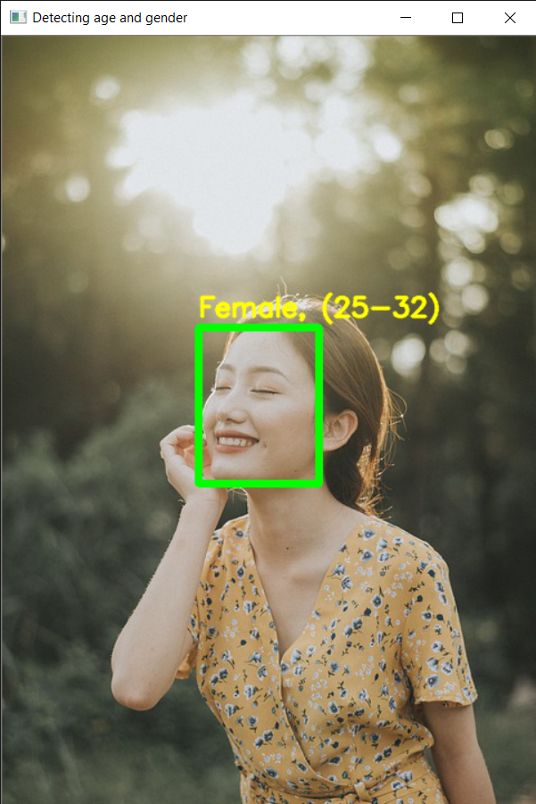

# Gender-and-Age-Detection   

<h2>Objective :</h2>

To build a gender and age detector that can approximately guess the gender and age of the person (face) in a picture or through webcam.

<h2>About the Project :</h2>

In this Python Project, I had used Deep Learning to accurately identify the gender and age of a person from a single image of a face. I used the models trained by Tal Hassner and Gil Levi. The predicted gender may be one of ‘Male’ and ‘Female’, and the predicted age may be one of the following ranges- (0 – 2), (4 – 6), (8 – 12), (15 – 20), (25 – 32), (38 – 43), (48 – 53), (60 – 100) (8 nodes in the final softmax layer). It is very difficult to accurately guess an exact age from a single image because of factors like makeup, lighting, obstructions, and facial expressions. And so, I made this a classification problem instead of making it one of regression.

<h2>Additional Python Libraries Required :</h2>
<ul>
  <li>OpenCV</li>
  
       pip install opencv-python
</ul>
<ul>
 <li>argparse</li>
  
       pip install argparse
</ul>

<h2>The contents of this Project :</h2>
<ul>
  <li>opencv_face_detector.pbtxt</li>
  <li>opencv_face_detector_uint8.pb</li>
  <li>age_deploy.prototxt</li>
  <li>age_net.caffemodel</li>
  <li>gender_deploy.prototxt</li>
  <li>gender_net.caffemodel</li>
  <li>detect.py</li>
 </ul>
 
For face detection, we have a .pb file- this is a protobuf file (protocol buffer); it holds the graph definition and the trained weights of the model. We can use this to run the trained model. And while a .pb file holds the protobuf in binary format, one with the .pbtxt extension holds it in text format. These are TensorFlow files. For age and gender, the .prototxt files describe the network configuration and the .caffemodel file defines the internal states of the parameters of the layers.

 

# Working:

<h2>Examples :</h2>

    >python detect.py --image man2.jpg
    Gender: Male
    Age: 25-32 years
    

    >python detect.py --image boy1.jpg
    Gender: Male
    Age: 8-12 years
    

    >python detect.py --image man1.jpg
    Gender: Male
    Age: 15-20 years    
    

    >python detect.py --image kid2.jpg
    Gender: Female
    Age: 4-6 years  
    

    >python detect.py --image woman1.jpg
    Gender: Female
    Age: 38-43 years
    

    >python detect.py --image girl1.jpg
    Gender: Female
    Age: 25-32 years
    

    
